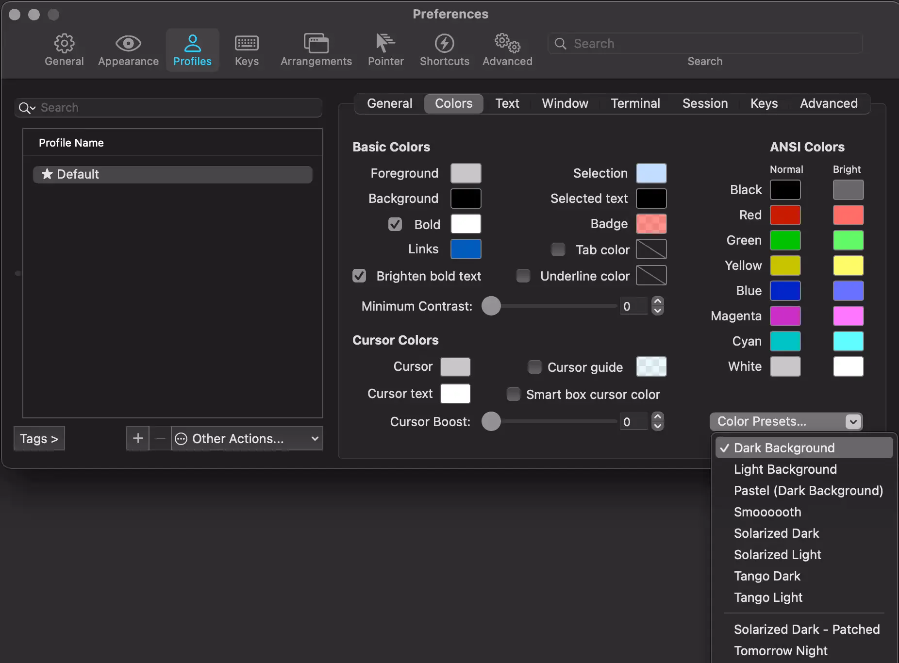
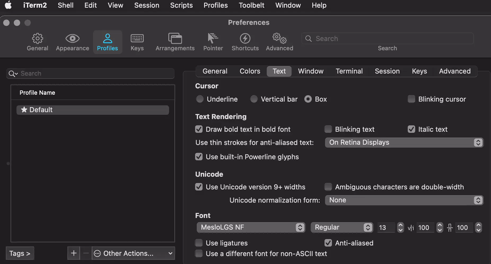

## 開頭

本篇文章紀錄如何美化 macOS 的 Terminal 環境 ，讓平常工作起來更高效。

本篇文章會安裝以下套件：

- Homebrew
- iTerm2
- Zsh
- Oh My Zsh
- Powerlevel 10k 主題
- zsh-autosuggestions
- zsh-syntax-highlighting
- Zsh-z

## 環境配置

環境配置為 macOS ， 並使用 iTerm2 為我們的終端機。

## 安裝 [Homebrew](https://brew.sh/index_zh-tw)

Homebrew 是一個在 macOS 上主流的套件管理工具，打開 Terminal 輸入以下指令安裝：

```shell
/bin/bash -c "$(curl -fsSL https://raw.githubusercontent.com/Homebrew/install/HEAD/install.sh)"
```

### 常用指令

更新套件清單

```shell
brew update
```

更新已安裝的套件

```shell
brew upgrade
```

Homebrew 安裝套件

```shell
brew install
```

更新用 Cask 安裝的套件

```shell
brew upgrade --cask
```

清除舊版套件檔案

```shell
brew cleanup
```

解除安裝套件

```shell
brew uninstall
```

## 安裝 [iTerm2](https://iterm2.com/)

iTerm2 是一個比內建 Terminal 更好的終端機。打開 Terminal 輸入以下指令，用 Homebrew 的 Cask 來安裝：

```shell
brew install --cask iterm2
```

## 變更 iTerm2 顏色主題

更改顏色主題的方式為 iTerm → Preferences → Profiles → Colors → Color Presets... 。我自己是使用預設的 Dark Background。

如果內建的不夠使用的話，這邊有很多顏色主題可供下載使用: https://github.com/mbadolato/iTerm2-Color-Schemes



## 查看已安裝的 Shell

```shell
cat /etc/shells
```

若沒有看到 zsh ，安裝 zsh

```shell
brew install zsh
```

## 安裝 [Oh My Zsh](https://ohmyz.sh/)

```shell
sh -c "$(curl -fsSL https://raw.githubusercontent.com/ohmyzsh/ohmyzsh/master/tools/install.sh)"
```

## (選用) 設定預設 Shell

若之前並沒有成功設定修改預設 Shell，請執行以下指令:

```shell
chsh -s $(which zsh)
```

執行 zsh 開始使用

```shell
zsh
```

## 安裝插件

### 主題 [PowerLevel10k](https://github.com/romkatv/powerlevel10k)

```shell
git clone https://github.com/romkatv/powerlevel10k.git $ZSH_CUSTOM/themes/powerlevel10k
```

### 插件 [zsh-autosuggestions](https://github.com/zsh-users/zsh-autosuggestions)

輸入指令時，如果看到灰色字的自動完成顯示，可以按下<kbd>➔</kbd>來採用。

```shell
git clone https://github.com/zsh-users/zsh-autosuggestions ${ZSH_CUSTOM:-~/.oh-my-zsh/custom}/plugins/zsh-autosuggestions
```

### 插件 [zsh-syntax-highlighting](https://github.com/zsh-users/zsh-syntax-highlighting)

```shell
git clone https://github.com/zsh-users/zsh-syntax-highlighting.git ${ZSH_CUSTOM:-~/.oh-my-zsh/custom}/plugins/zsh-syntax-highlighting
```

### (選用) 插件 [Zsh-z](https://github.com/agkozak/zsh-z)

類似於 [autojump](https://github.com/wting/autojump) 的插件，比 `cd` 更快速地直接跳到想去的資料夾，且效能更好沒有一堆依賴包。

```shell
git clone https://github.com/agkozak/zsh-z $ZSH_CUSTOM/plugins/zsh-z
```

#### 使用方法

查看已知的資料夾位置

```shell
z
```

進入在子資料夾中包含此字串的資料夾，可以用 <kbd>Tab</kbd> 來選擇結果，如果有多個符合 et 的資料的話。

```shell
cd /
z et
```

查看其他用法

```shell
z -h
```

## 啟動插件

1.打開 Zsh 用戶設定檔

```shell
open ~/.zshrc
```

2.修改主題

`ZSH_THEME="powerlevel10k/powerlevel10k"`

3.新增要啟動的插件 (Plugins)

`plugins=(git zsh-autosuggestions zsh-syntax-highlighting zsh-z)`

儲存。

4.應用修改過的 zshrc

```shell
source ~/.zshrc
```

## Powerlevel10k 設定

若之前沒有啟動 Powerlevel10k 設定小幫手，或是還需要重新設定 Powerlevel10k，

打開 Shell 輸入：

```shell
p10k configure
```

應用修改 `~/.zshrc` 之後，因為第一次使用 Powerlevel10k，會自動啟動設定。

若是之前沒有安裝過 Patched 過的字型，設定精靈會詢問是否要幫你安裝 **Meslo Nerd Font**。  
按造設定精靈的提示，安裝完字體之後會要求你重新開啟 iTerm2 。  
這邊需要使用 <kdb>Command + Q</kdb> 關閉 iTerm2 之後重新開啟。

之後就會進入設定的畫面，按造你的需求完成設定即可。

## 下載安裝 Patched 字型

若是沒有碰到設定精靈詢問你安裝字型的問題，然後顯示是有亂碼的話

請下載並安裝以下四個字型：

- [MesloLGS NF Regular.ttf](https://github.com/romkatv/dotfiles-public/raw/master/.local/share/fonts/NerdFonts/MesloLGS%20NF%20Regular.ttf)
- [MesloLGS NF Bold.ttf](https://github.com/romkatv/dotfiles-public/raw/master/.local/share/fonts/NerdFonts/MesloLGS%20NF%20Bold.ttf)
- [MesloLGS NF Italic.ttf](https://github.com/romkatv/dotfiles-public/raw/master/.local/share/fonts/NerdFonts/MesloLGS%20NF%20Italic.ttf)
- [MesloLGS NF Bold Italic.ttf](https://github.com/romkatv/dotfiles-public/raw/master/.local/share/fonts/NerdFonts/MesloLGS%20NF%20Bold%20Italic.ttf)

或是用指令的方式下載：

```shell
wget https://github.com/romkatv/dotfiles-public/raw/master/.local/share/fonts/NerdFonts/MesloLGS%20NF%20Regular.ttf &&
wget https://github.com/romkatv/dotfiles-public/raw/master/.local/share/fonts/NerdFonts/MesloLGS%20NF%20Bold.ttf &&
wget https://github.com/romkatv/dotfiles-public/raw/master/.local/share/fonts/NerdFonts/MesloLGS%20NF%20Italic.ttf &&
wget https://github.com/romkatv/dotfiles-public/raw/master/.local/share/fonts/NerdFonts/MesloLGS%20NF%20Bold%20Italic.ttf
```

下載完成打開字型檔案，點擊 Install Font 。

### 修改 iTerm2 字型

更改字型的方式為 iTerm → Preferences → Profiles → Text → Font 。把 Font 改成 **MesloLGS NF**。



## 完結
