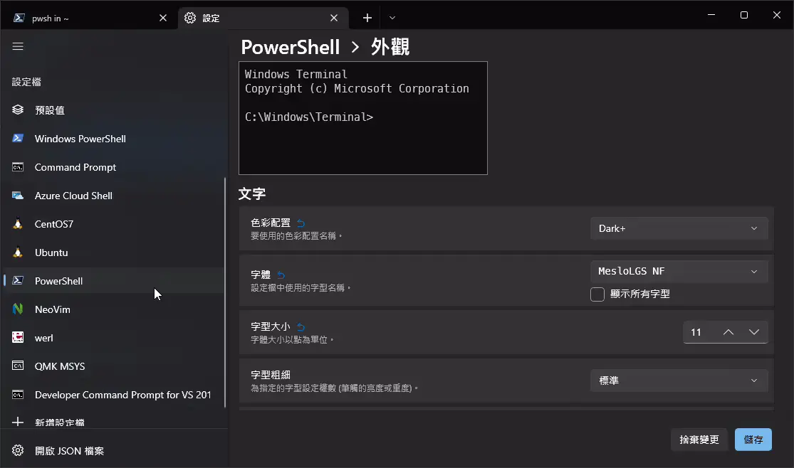
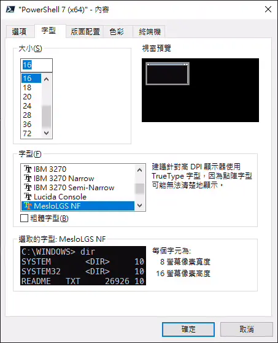

## 開頭

[Oh My Posh](https://ohmyposh.dev/) 是一個主題引擎可以美化 PowerShell 7 （pwsh）。

本篇文章紀錄 Oh My Posh 的安裝與主題置換來美化你的 pwsh，並可更改主題 (theme)。除此之外，我們還會新增幾個插件來擴充 pwsh 的功能性，進一步提高使用效率。包含指令自動完成，快速切換資料夾等等。

本篇文章會介紹以下套件的安裝：

- [Oh My Posh](https://ohmyposh.dev/)
- [Git](https://community.chocolatey.org/packages/git)
- [Posh-Git](https://github.com/dahlbyk/posh-git)
- [ZLocation](https://github.com/vors/ZLocation)
- [NeoFetch](https://github.com/dylanaraps/neofetch)

## 環境配置

- Windows 10
- Windows Terminal
- PowerShell 7

## 安裝 gsudo

推薦安裝 gsudo ，可以更方便地提升權限到系統管理員權限，  
請參考： [gsudo - 讓 Windows 也有 sudo 功能](/dev-env/gsudo)

## 安裝 PowerShell 7

若還沒有安裝最新版的 PowerShell 7 ，  
請參考： [PowerShell 7 - 來安裝最新版的 PowerShell](/dev-env/pwsh)

## 安裝 Windows Terminal

若還沒有安裝最新版的 Windows Terminal，  
請參考： [改用 Windows Terminal - 比 Cmder 更好用的現代終端機](/dev-env/windows-terminal)

## 安裝 Git

若還沒有安裝 Git ，可以使用 [chocolatey](https://chocolatey.org/install) 來安裝。

使用 gsudo 取得一次性系統管理員權限來安裝

```shell
sudo choco install git -y
```

## 安裝 Oh My Posh

pwsh 輸入

```shell
winget install JanDeDobbeleer.OhMyPosh -s winget
```

用文字編輯器編輯 `$Profile`

```shell
notepad $Profile
```

:::tip

若是找不到 `$Profile，執行以下指令來新增。

```sh
New-Item -Path $PROFILE -Type File -Force
```

:::

添加以下，儲存後關閉。

```shell
/// title: $Profile
oh-my-posh init pwsh | Invoke-Expression
```

重新開啟 Windows Terminal 後生效，或是輸入以下指令應用修改，

```shell
. $Profile
```

## 安裝 Patched 字型

為了 Oh My Posh 的主題可以正常顯示字型與圖示，下載以下字型包並安裝:

[https://github.com/ryanoasis/nerd-fonts/releases/download/v2.1.0/Meslo.zip](https://github.com/ryanoasis/nerd-fonts/releases/download/v2.1.0/Meslo.zip)

或是使用 `oh-my-posh` 來安裝。這邊必須使用 gsudo 取得一次性系統管理員權限來安裝。

```sh
sudo oh-my-posh font install
```

### 更改字型

#### Windows Terminal

<kbd>Ctrl + ,</kbd> 打開設定，選擇 PowerShell 7 的設定檔 `外觀 > 字型`，將字型改成 `MesloLGS NF` 之後儲存。



#### PowerShell 7

以系統管理員身分執行 PowerShell 7(x64)，更改字型為 `MesloLGS NF`



### 更改 Oh My Posh 主題

Oh My Posh 內建很多不同的主題 (theme)，請查看[官網](https://ohmyposh.dev/docs/themes)

或是輸入以下指令查看內建的主題與預覽，

```shell
Get-PoshThemes
```

確定好了主題，讓我們修改 `$Profile` 來設定預設要使用的主題，

把 `oh-my-posh init pwsh ...` 的部分後面加上 `--config "$env:POSH_THEMES_PATH\{主題名稱}.omp.json"`。

例如

```shell
/// title: $Profile
oh-my-posh init pwsh --config "$env:POSH_THEMES_PATH\powerlevel10k_modern.omp.json" | Invoke-Expression
```

重新開啟 Windows Terminal 後生效，或是輸入以下指令應用修改，

```shell
. $Profile
```

## 安裝插件 [posh-git](https://github.com/dahlbyk/posh-git)

[posh-git](https://github.com/dahlbyk/posh-git) 讓 Git 的指令可已用 <kbd>Tab</kbd> 自動完成。

pwsh 輸入來安裝

```shell
sudo choco install poshgit
```

在 `$Profile` 檔案最後一行新增以下指令：

```shell
Import-Module posh-git
```

## 安裝插件 [ZLocation](https://github.com/vors/ZLocation)

[ZLocation](https://github.com/vors/ZLocation) 類似於 [autojump](https://github.com/wting/autojump) 或是 [Zsh-z](https://github.com/agkozak/zsh-z) 的插件，  
可以用關鍵字直接跳到想去的資料夾，比使用 `cd` 更快速。

1.安裝 ZLocation

用 PowerShell 輸入以下指令：

```shell
Install-Module ZLocation -Scope CurrentUser
```

輸入 [A] Yes to All ，全部同意。

2.修改使用者設定

```shell
notepad $Profile
```

在 `$Profile` 檔案最後一行新增以下指令，

```shell
/// title: $Profile
Import-Module ZLocation
```

重新開啟 Windows Terminal 後生效，  
或是輸入以下指令應用修改，

```shell
. $Profile
```

### ZLocation 使用方式

查看已知的資料夾位置

```shell
z
```

進入包含此字串的資料夾，可以用 `Tab` 來選擇結果，如果有多個資料夾符合 doc 的話。

```shell
z doc
```

回到之前的資料夾

```shell
z -
```

## (選用) 安裝 NeoFetch

NeoFetch 用來顯示電腦配置。

即使已經有安裝 git 了，這邊還是要安裝 git ，因為 neofetch 會直接使用 scoop 安裝的 git 。

打開 pwsh 輸入以下指令，

```shell
scoop install git
scoop install neofetch
```

執行 NeoFech

```shell
neofetch
```

## (選用) 舊版錯誤訊息

如果你看到以下錯誤訊息，

```shell
Hey friend

In an effort to grow oh-my-posh, the decision was made to no

longer support the PowerShell module. Over the past year, the

added benefit of the module disappeared, while the burden of

maintaining it increased.

However, this doesn't mean oh-my-posh disappears from your

terminal, it just means that you'll have to use a different

tool to install it.

All you need to do, is follow the migration guide here:

https://ohmyposh.dev/docs/migrating
```

表示你過去是用 `Install-Module` 的方式安裝 Oh My Posh，如以下：

```shell
Install-Module oh-my-posh -Scope CurrentUser
```

詳細情況請參考[官方網站](https://ohmyposh.dev/docs/migrating)。

### 解決辦法

刪除過去的版本。打開 pwsh 輸入

```shell
Uninstall-Module oh-my-posh -AllVersions
```

移除 `$Profile` 裡的 `Import-Module oh-my-posh`

```shell
notepad $Profile
```

然後回到[最上面的開始](#an1-zhuang1-oh-my-posh)的流程重新安裝。

## 完結
