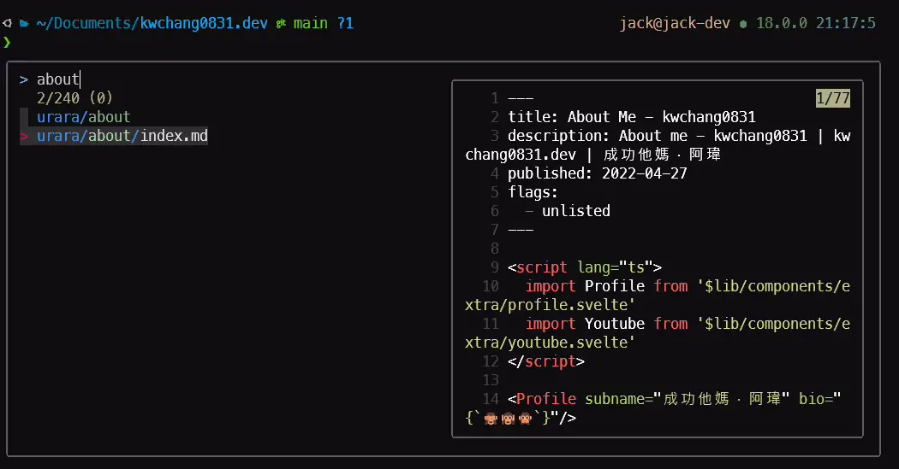

## 開頭

本篇文章會安裝以下：

- [Fish Shell](https://fishshell.com/)
- [Fisher](https://github.com/jorgebucaran/fisher)
- [Tide](https://github.com/IlanCosman/tide)
- [Z](https://github.com/jethrokuan/z)
- [Sponge](https://github.com/andreiborisov/sponge)
- [autopair.fish](https://github.com/jorgebucaran/autopair.fish)
- [fzf.fish](https://github.com/PatrickF1/fzf.fish)
  - [fzf](https://github.com/junegunn/fzf)
  - [fd](https://github.com/sharkdp/fd)
  - [Bat](https://github.com/sharkdp/bat)
- asdf 自動完成

安裝完，你會得到一個簡單好上手的指令介面。



## 環境配置

我的使用環境為 Windows 10 的 Windows Terminal + pwsh 連進 Ubuntu 22.04 LTS 使用。


## 安裝 必要套件

shell 輸入

```shell
sudo apt install wget git curl vim -y
```

## 安裝 Patched 字型

我們必須先安裝 Patched 過的字型，之後才能正確地顯示字型與圖示，這邊建議使用 **MesloLGS NF** 字體。

### 第一種方式

下載並安裝以下四個字型：

- [MesloLGS NF Regular.ttf](https://github.com/romkatv/dotfiles-public/raw/master/.local/share/fonts/NerdFonts/MesloLGS%20NF%20Regular.ttf)
- [MesloLGS NF Bold.ttf](https://github.com/romkatv/dotfiles-public/raw/master/.local/share/fonts/NerdFonts/MesloLGS%20NF%20Bold.ttf)
- [MesloLGS NF Italic.ttf](https://github.com/romkatv/dotfiles-public/raw/master/.local/share/fonts/NerdFonts/MesloLGS%20NF%20Italic.ttf)
- [MesloLGS NF Bold Italic.ttf](https://github.com/romkatv/dotfiles-public/raw/master/.local/share/fonts/NerdFonts/MesloLGS%20NF%20Bold%20Italic.ttf)

或是 shell 輸入

```shell
wget https://github.com/romkatv/dotfiles-public/raw/master/.local/share/fonts/NerdFonts/MesloLGS%20NF%20Regular.ttf &&
wget https://github.com/romkatv/dotfiles-public/raw/master/.local/share/fonts/NerdFonts/MesloLGS%20NF%20Bold.ttf &&
wget https://github.com/romkatv/dotfiles-public/raw/master/.local/share/fonts/NerdFonts/MesloLGS%20NF%20Italic.ttf &&
wget https://github.com/romkatv/dotfiles-public/raw/master/.local/share/fonts/NerdFonts/MesloLGS%20NF%20Bold%20Italic.ttf
```

### 第二種方式

Github [@ryanoasis/nerd-fonts](https://github.com/ryanoasis/nerd-fonts?tab=readme-ov-file#tldr)

## 安裝 Fish shell

新增來源庫 > 更新 > 安裝 [Fish shell](https://fishshell.com/)

shell 輸入

```shell
sudo apt-add-repository ppa:fish-shell/release-3
sudo apt update
sudo apt install fish
```

### 設定預設 Shell

shell 輸入

```shell
chsh -s $(which fish)
```

## 安裝 Fisher

[Fisher](https://github.com/jorgebucaran/fisher) 是插件管理員。

```shell
curl -sL https://raw.githubusercontent.com/jorgebucaran/fisher/main/functions/fisher.fish | source && fisher install jorgebucaran/fisher
```

### 查看已安裝插件

```shell
fisher list
```

結果

```shell
❯ fisher list
jorgebucaran/fisher
ilancosman/tide@v6
jethrokuan/z
andreiborisov/sponge
jorgebucaran/autopair.fish
patrickf1/fzf.fish
```

## 安裝 Tide 主題

還記得 Zsh 的 [PowerLevel10k](https://github.com/romkatv/powerlevel10k) 嗎? Tide 基本上就很像 PowerLevel10k。

<!-- https://github.com/IlanCosman/tide/raw/assets/animations/configuration_wizard.gif -->


安裝 [Tide](https://github.com/IlanCosman/tide) ，輸入

```shell
fisher install IlanCosman/tide@v6
```

### 設定 Tide 主題

安裝完成後，輸入

```shell
tide configure
```

## 安裝插件 Z

插件 [Z](https://github.com/jethrokuan/z) 類似於 [autojump](https://github.com/wting/autojump) 的插件，比 `cd` 更快速地直接跳到想去的資料夾。

```shell
fisher install jethrokuan/z
```

## 安裝插件 Sponge

[Sponge](https://github.com/meaningful-ooo/sponge) 讓指令歷史紀錄更乾淨，不會去紀錄失敗或是打錯的指令到歷史清單中。

```shell
fisher install andreiborisov/sponge
```

### 清除指令歷史

```shell
history clear
```

## 安裝插件 autopair.fish

[autopair.fish](https://github.com/jorgebucaran/autopair.fish) 自動幫你補上 `()`， `[]`， `{}`， `""`， 還有 `''`

```shell
fisher install jorgebucaran/autopair.fish
```

## 安裝插件 fzf.fish

[fzf.fish](https://github.com/PatrickF1/fzf.fish) 讓你的 Fish 互動性更強大。

找檔案 <kbd>Ctrl + Alt + F</kbd>

<!-- https://github.com/PatrickF1/fzf.fish/raw/assets/directory.gif -->


找指令歷史紀錄 <kbd>Ctrl + R</kbd>

<!-- https://github.com/PatrickF1/fzf.fish/raw/assets/command_history.gif -->


找 PID <kbd>Ctrl + Alt + P</kbd>

<!-- https://github.com/PatrickF1/fzf.fish/raw/assets/processes.gif -->


還有很多功能，請參考 [fzf.fish 來源庫](https://github.com/PatrickF1/fzf.fish)。

### 安裝前置套件 fzf

```shell
git clone --depth 1 https://github.com/junegunn/fzf.git ~/.fzf
~/.fzf/install
```

### 安裝前置套件 fd

```shell
sudo apt install fd-find
```

因為已經有其他叫 fd 的套件，為了避免衝突，所以執行檔是叫 fdfind。我們這邊建立個連結在 `/usr/local/bin` 叫做 `fd` 讓我們可以使用 `fd` 這個指令。

```shell
sudo ln -s $(which fdfind) /usr/local/bin/fd
```

### 安裝前置套件 bat

```shell
sudo apt install bat
```

因為已經有其他叫 bat 的套件，為了避免衝突，所以執行檔是叫 batcat。我們這邊建立個連結在 `/usr/local/bin` 叫做 `bat` 讓我們可以使用 `bat` 這個指令。

```shell
sudo ln -s $(which batcat) /usr/local/bin/bat
```

### 安裝 fzf.fish

```shell
fisher install PatrickF1/fzf.fish
```

## 設定 asdf 自動完成

若已經有安裝使用 [asdf](https://asdf-vm.com/) 軟體版本管理器，設定自動完成如下

```shell
vi ~/.config/fish/config.fish
```

在 `~/.config/fish/config.fish` 文件最後添加

```shell title="~/.config/fish/config.fish"
source ~/.asdf/asdf.fish
```

最後，輸入以下指令，連結自動完成的功能

```shell
mkdir -p ~/.config/fish/completions; and ln -s ~/.asdf/completions/asdf.fish ~/.config/fish/completions
```

## 完結
