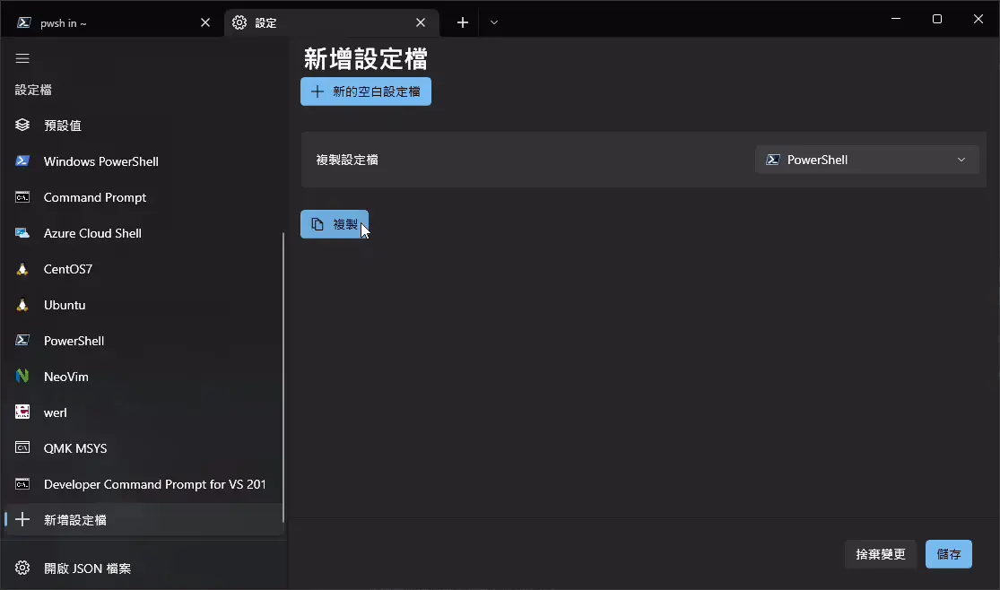
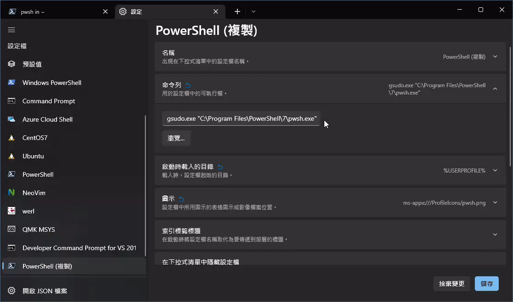

## 開頭

gsudo 能在 Windows 上提供類似於 Linux 上的 sudo 功能，  
讓我們使用指令提升至系統管理員權限。

舉例來說，我們可以在 cmd 輸入 `sudo` 來開啟 [UAC](https://zh.wikipedia.org/wiki/%E4%BD%BF%E7%94%A8%E8%80%85%E5%B8%B3%E6%88%B6%E6%8E%A7%E5%88%B6)
讓目前的 cmd 進程提升至到有系統管理員權限的 cmd 。

本篇文章紀錄 gsudo 的使用介紹與基本安裝。

## 安裝方式 1. PowerShell

```shell
PowerShell -Command "Set-ExecutionPolicy RemoteSigned -scope Process; iwr -useb https://raw.githubusercontent.com/gerardog/gsudo/master/installgsudo.ps1 | iex"
```

## 安裝方式 2. [Chocolatey](https://chocolatey.org/install)

```shell
choco install gsudo -y
```

## 安裝方式 3. [Scoop](https://scoop.sh/)

```shell
scoop install gsudo
```

## 安裝方式 4. [WinGet](https://github.com/microsoft/winget-cli/releases)

```shell
winget install gsudo
```

## 安裝完成

安裝完成後，會詢問是否使用 `sudo` 來取代原來的 `gsudo` 這個指令，選擇 (Y)。

## 在 Windows Terminal 新增管理員權限的 pwsh

### 新增 Shell Profile

<kbd>Ctrl + ,</kbd> 打開設定，點擊 `新增設定檔` ，選擇複製 新版的 PowerShell，



### 修改命令列

修改命令列的指令，添加 `gsudo.exe` 於前方

```shell
gsudo.exe "C:\\Program Files\\PowerShell\\7\\pwsh.exe"
```



### 儲存

記得更改一下設定檔的名稱，舉例: `PowerShell (Admin)`  
之後按下儲存即可。

## gsudo 相關指令

在這裡列出比較常用的指令

### 取得系統管理員權限

```shell
sudo
```

### 開啟具有系統管理員權限的 Shell

```shell
sudo -n
```

在 Windows Terminal 上，並不會開啟新的 Shell Tab。而會開啟新的 PowerShell 視窗。

### 離開系統管理員權限

```shell
exit
```

若目前有系統管理員權限會取消管理員權限；若沒有則會關閉該 Shell Tab。

### 其他指令

請參考: https://github.com/gerardog/gsudo#usage

## 完結
