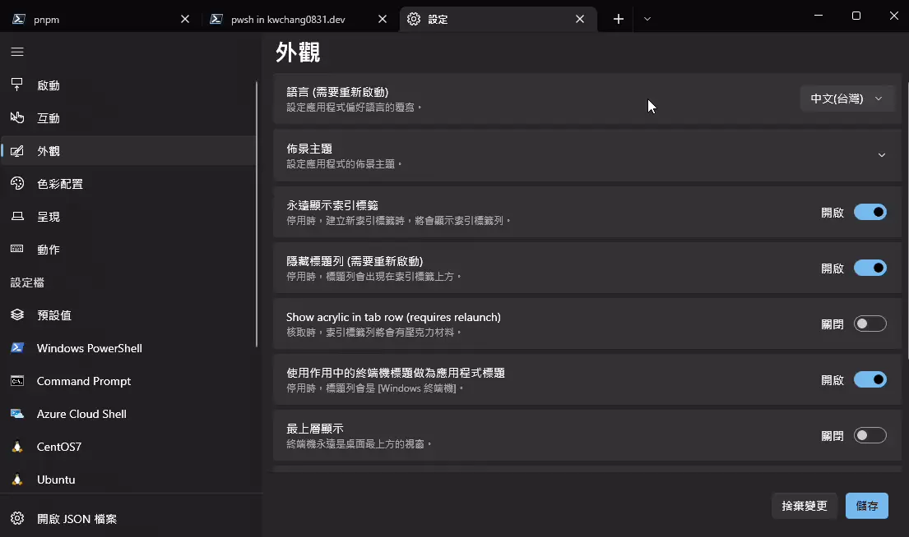
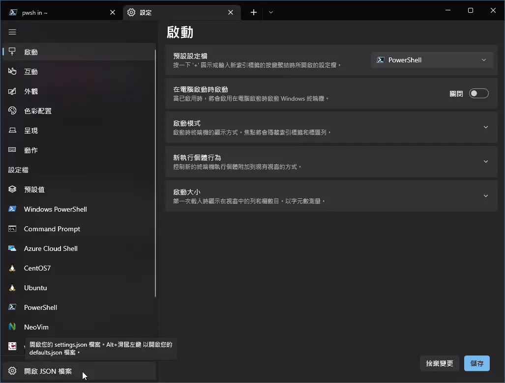
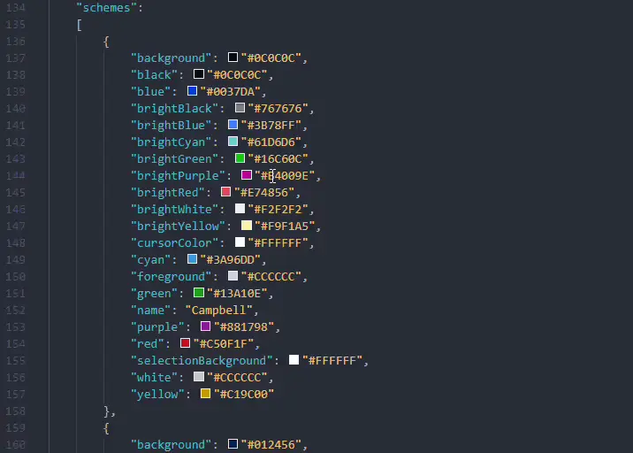
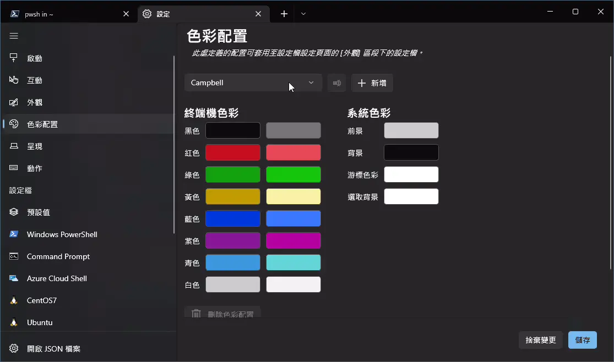

## 開頭

Windows Terminal 是一款由微軟於 2019 年釋出的現代化終端機應用程式。  
可以執行各種不同的 Shell (命令提示字元、PowerShell、WSL...等等)。

本篇文章記錄 Windows Terminal 基本安裝與設置。

## 安裝方式 1. Microsoft Store

打開 Microsoft Store，搜尋 `Windows Terminal`，點選 `取得` 來安裝。

或使用以下網址:  
https://www.microsoft.com/zh-tw/p/windows-terminal/9n0dx20hk701?rtc=1#activetab=pivot:overviewtab

## 安裝方式 2. [Chocolatey](https://chocolatey.org/install)

以有系統管理員權限的 `cmd` 或 `powershell` 執行以下

```shell
choco install microsoft-windows-terminal -y
```

若還沒有安裝過 `Chocolatey` ，打開 `powershell` 執行以下指令進行安裝

```shell
Set-ExecutionPolicy Bypass -Scope Process -Force; [System.Net.ServicePointManager]::SecurityProtocol = [System.Net.ServicePointManager]::SecurityProtocol -bor 3072; iex ((New-Object System.Net.WebClient).DownloadString('https://community.chocolatey.org/install.ps1'))
```

## 更改顯示語言

若是需要更改顯示語言，<kbd>Ctrl +，</kbd> 打開設定， 選擇 `外觀 > 語言` 來進行修改。


更改後若沒有生效，請結束 Windows Terminal 後重新開啟。

## 新增介面主題

可以到以下網址尋找自己喜歡的主題：  
https://windowsterminalthemes.dev/

找到喜歡的主題之後，點選 Get theme ，設定檔就會被複製到剪貼簿上。

回到 Windows Terminal ， <kbd>Ctrl +，</kbd> 打開設定，點選 `開啟 JSON 檔案` 。


找到 `"schemes":` 區塊, <kbd>Ctrl + V</kbd> 貼上剛剛的設定檔到 schemes 底下。

記得要加上一個逗號，每個設定檔之間都要有 `，` 區隔。



之後就可以在 `設定 > 色彩配置` 裡看到你剛剛新增的主題了。



## 完結
