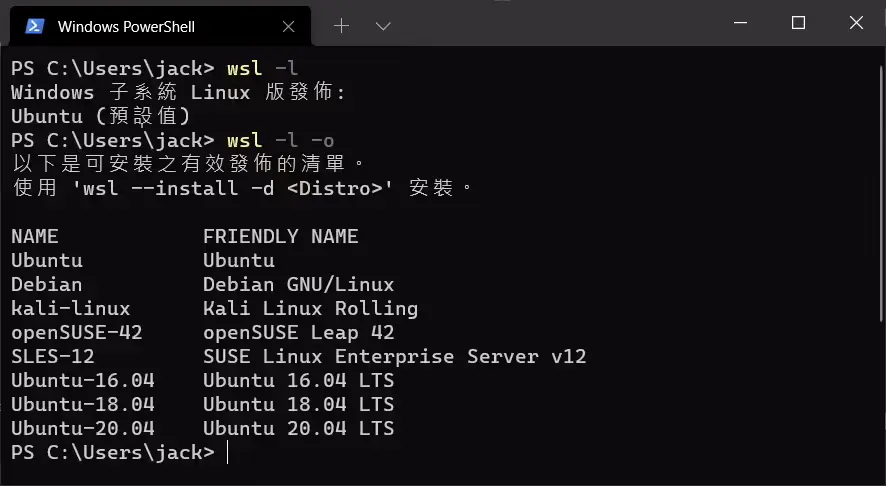
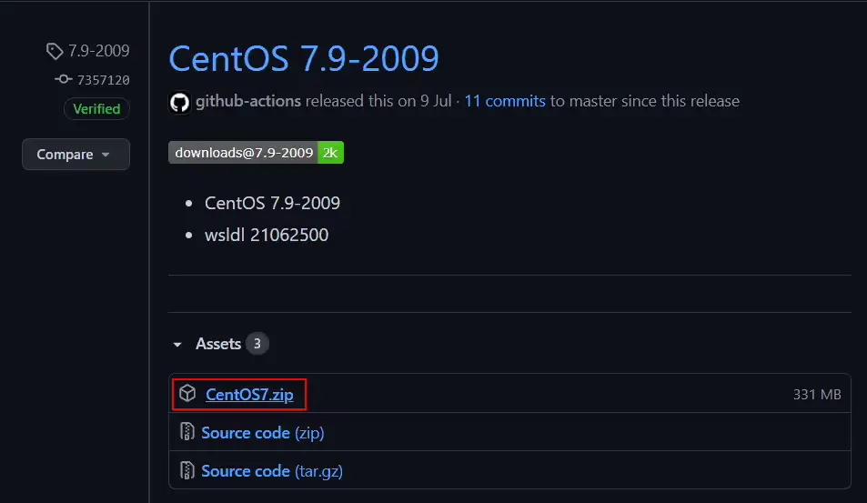
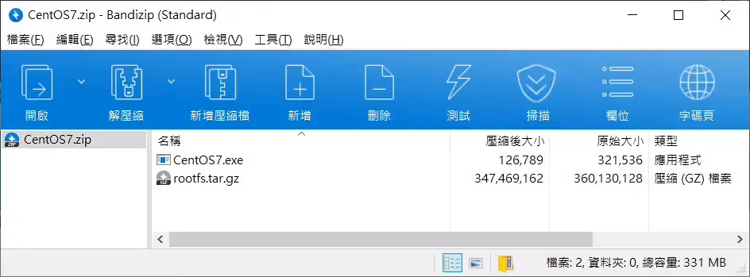
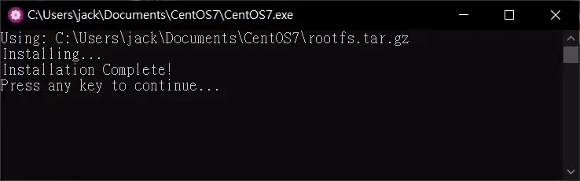
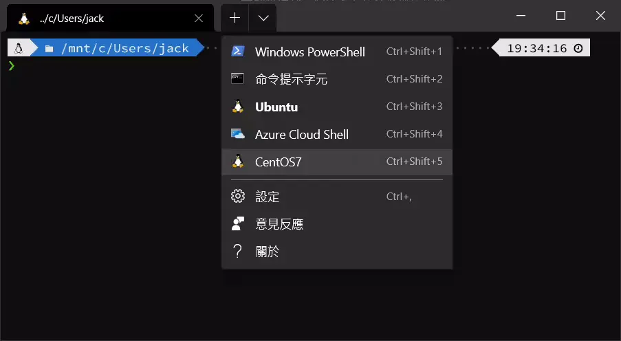
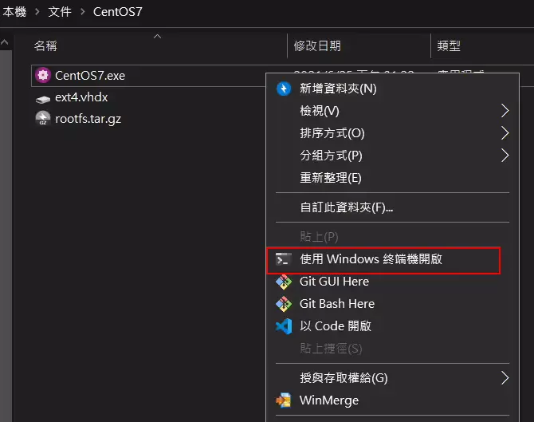

## 開頭

本篇文章紀錄如何在 Windows 10 的 Linux 子系統 (WSL) 內安裝 Centos 。

預設並沒有提供 Centos 的 image 可供安裝，  
這邊會介紹如何下載可供 WSL 安裝的 image 檔案來進行安裝。

## 環境配置

請確認已經安裝好 WSL 與 Windows Terminal，若是還沒有設置好，請參考：

- 從 [Windows 上用 WSL 安裝 Ubuntu](/dev-env/wsl/ubuntu) 參考 安裝 WSL
- 從 [Windows Terminal - 比 Cmder 更好用的終端機](/dev-env/windows-terminal) 參考 安裝 Windows Terminal

## 查詢可用 Linux Distro

```shell
wsl -l -o
```

列表裡並沒有 Centos7 可以安裝，沒關係，我們去找可供 WSL 安裝的 Image 檔案。



## 下載 CentOS Image

我們這邊示範的版本是 CentOS 7.9-2009

https://github.com/mishamosher/CentOS-WSL/releases/tag/7.9-2009



如果需要別的版本，請參考 https://github.com/mishamosher/CentOS-WSL/releases

裡面包含以下版本：

- CentOS 8-stream
- CentOS 8
- CentOS 7
- CentOS 6

下載好之後，請解壓縮到一個適合存放的資料夾裡。



## 安裝 Centos 7

點擊兩下執行安裝。安裝會自動執行。最後會要你輸入任何按鍵以繼續，就完成安裝了。



## Windows Terminal

如果之前已經有安裝 Windows Terminal。 Centos7 的選項會自動匯入。  
如果沒有顯示 Centos 7 的選項，請關閉所有 Windows Terminal 重新開啟就會自動匯入了。



## 更新 Centos

```shell
yum -y update && yum -y upgrade
```

## 解除安裝 Centos

如果想要解除安裝，於 Centos 7 存放檔案的資料夾開啟 Windows Terminal ，輸入以下指令：

```shell
./Centos7.exe clean
```



Windows Terminal 裡面的 Centos7 選項會自己刪除。  
只要關閉再重新開啟 Windows Terminal 就可以了。

## (選用) 安裝 NeoFetch

NeoFetch 是一個顯示電腦配置的小工具。

1.安装 epel-release

```shell
yum install epel-release -y
```

2.增加第三方來源庫

```shell
curl -o /etc/yum.repos.d/konimex-neofetch-epel-7.repo https://copr.fedorainfracloud.org/coprs/konimex/neofetch/repo/epel-7/konimex-neofetch-epel-7.repo
```

3.安裝 NeoFetch

```shell
yum install neofetch -y
```

## 完結
