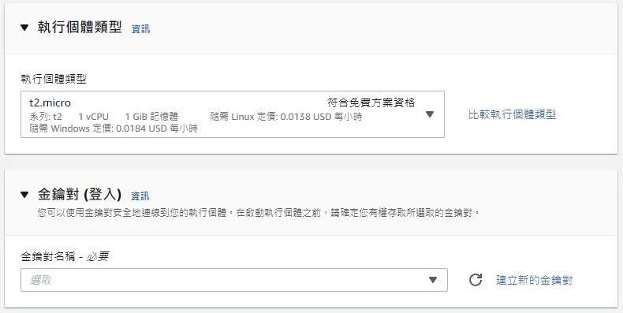

## 緣由

過去，我是使用 [Umami](https://github.com/umami-software/umami) 來進行網站訪問統計的追蹤，來了解我文章的受眾，並以此為依據來修正改善。

架設 [Umami](https://github.com/umami-software/umami) ，我是使用 [Vercel](https://vercel.com/)，而數據庫則使用 [Postgresql](https://www.postgresql.org/) 並放在 [Railway](https://railway.app/) 上。 恩，沒錯，全部都是免費使用。

不得不說 Railway 這平台真的簡單好用，設計得非常好。只可惜，不久前他們正式[取消了 Early Adopter Plan](https://railway.app/changelog/2022-7-15)。現在改成了 Stater Plan ，差別就是現在每個月只給你 500 小時與 免費的 $5 Credits。一個月 31天至少需要 744小時，這樣就變得不再適合架設 [Umami](https://github.com/umami-software/umami) 了，除非升級成 Developer Plan。升級需要填入信用卡，變成依照使用程度來付費或是 Credit 制的訂閱。我在寫這篇文章的時候才仔細算了下。升級之後 500 小時的限制可以解除，對於我過去的記憶體與 CPU 使用量來看應當是低於 $3 每個月。所以，其實還是可以免費架設 [Umami](https://github.com/umami-software/umami)。

不過，我一直都很想嘗試 [Plausible](https://plausible.io/)，尤其是它標榜超快速超輕量，不會被擋掉。我就跑去申請了 AWS 帳號拿免費12個月 EC2 的試用。喔，忘了說使用 [Umami](https://github.com/umami-software/umami) 的時候，在 [Brave](https://brave.com/) 瀏覽器預設打開 Shields 的情況下與 Google Analytics 一樣都會看到瀏覽器跑出 `Failed to load resource: net::ERR_BLOCKED_BY_CLIENT` 的錯誤。而，我目前使用 [Plausible](https://plausible.io/) 並沒有遇到這問題。

## 開頭

言歸正傳，這篇文章主要是紀錄，如何在 AWS EC2 上架設 Plausible。

以下流程，執行個體 (Instance) 會安裝 Ubuntu 22.04 LTS 作為 OS。即使你使用 [Digital Ocean](https://www.digitalocean.com/) 或其他的 VPS Hosting，本篇文章應當對你都有一定的幫助。

## 申請 AWS 帳號

AWS 免費方案申請 [https://aws.amazon.com/tw/free/](https://aws.amazon.com/tw/free/)。

## 建立 EC2 執行個體

進入 [EC2 服務頁面](https://us-west-1.console.aws.amazon.com/ec2/home?region=us-west-1#Home:)，區域我選擇的是 **us-west-1** 美國西部 (加州北部)。


點選**啟動執行個體**來創建新的執行個體，這時你需要設定名稱/標籤與作業系統等等的設定。


執行個體的類型我這邊選擇的是**t2.micro**，記得是要選**符合免費方案資格**的。然後點選**建立新的金鑰對**。


你之後會需要這個金鑰才能 SSH 進入這個執行個體，下載你的金鑰 **.PEM** 至一個安全的地方，我通常會丟到 `~/.ssh` 資料夾底下。


接下來網路設定的部分，勾選**允許來自網際網路的 HTTPs 流量**。至於允許 SSH 流量，來自，依照自己的喜好與情況選擇 隨處 0.0.0.0/0 或是 只有你的 IP 才可以 SSH 登入。


:::info
這邊只勾選**允許來自網際網路的 HTTPs 流量**，而沒有勾選 **允許來自網際網路的 HTTP 流量**，是因為未來我們都只會透過 Https 的方式登入 Plausible。後續會提到如何使用 Certbot 自動生成免費的 SSL 憑證，所以暫時不用擔心這問題。
:::

其他的設定維持預設即可。接下來就可以點選**啟動執行個體**的按鈕創建。

## 連線至你的執行個體

創建好你的執行個體之後，回到EC2的首頁確認右上角的區域還是**加州北部 (us-west-1)**，點選你的執行個體之後點選**連線**。


我是選擇用 SSH 的方式進行連線，範例:

```sh
ssh -i "your_key.pem" ubuntu@ec2-公有_IPv4_DNS
```

## 設定你的 Ubuntu

連線進去之後，第一件事情就是創建你的使用者帳戶，不然每次都用 root 帳號登入與處理事情不太適合。

### 創建使用者

記得改成你的名字。

```sh
adduser kwchang0831
```

授予 sudo 權限。

```sh
usermod -aG sudo kwchang0831
```

複製 ssh keys。

```sh
rsync -a --chown kwchang0831:kwchang0831 ~/.ssh /home/kwchang0831
```

現在離開換成你的用戶名稱來連線應該沒問題。

```sh
exit
ssh -i "your_key.pem" kwchang0831@ec2-公有_IPv4_DNS
```

更改 ssh 設定。

```sh
sudo nano /etc/ssh/sshd_config
```

找到 `PermitRootLogin` ，修改成不能用密碼來登入 root。若要更安全也可以改成 `no`，反正之後我們都會使用有 sudo 權限的用戶帳號來做事。

```text
PermitRootLogin prohibit-password
```

重新啟動 ssh 伺服器。

```sh
sudo systemctl restart ssh
```

### 安裝 Docker

刪除之前安裝的 Docker，之前若沒安裝過也還是可以跑一下確認沒關係。

```sh
sudo apt-get remove docker docker-engine docker.io containerd runc
```

更新 Ubuntu。

```sh
sudo apt update -y && sudo apt upgrade -y
```

安裝所需的套件。

```sh
sudo apt-get install apt-transport-https ca-certificates curl gnupg lsb-release
```

新增 GPG 金鑰。

```sh
curl -fsSL https://download.docker.com/linux/ubuntu/gpg | sudo gpg --dearmor -o /usr/share/keyrings/docker-archive-keyring.gpg
```

設置 Repo。

```sh
echo "deb [arch=$(dpkg --print-architecture) signed-by=/usr/share/keyrings/docker-archive-keyring.gpg] https://download.docker.com/linux/ubuntu $(lsb_release -cs) stable" | sudo tee /etc/apt/sources.list.d/docker.list > /dev/null
```

安裝 Docker。

```sh
sudo apt update -y && sudo apt-get install docker-ce docker-ce-cli containerd.io -y
```

查看 Docker 版本 確認安裝。

```sh
docker -v
```

### 安裝 Docker Compose

下載 2.10.2 版本 Docker Compose (若有更新版本可自行修改下方的網址)。

```sh
sudo curl -L "https://github.com/docker/compose/releases/download/v2.10.2/docker-compose-$(uname -s)-$(uname -m)" -o /usr/local/bin/docker-compose
```

這裡可以查看 Docker Compose 最新版本: [https://github.com/docker/compose/releases/](https://github.com/docker/compose/releases/)。

給予 docker-compose 執行權限。

```shell
sudo chmod +x /usr/local/bin/docker-compose
```

連結。

```sh
sudo ln -s /usr/local/bin/docker-compose /usr/bin/docker-compose
```

查看版本 確認安裝。

```sh
docker-compose --version
```

增加 `docker` 群組至使用者。(記得改成自己的用戶名)。

```sh
sudo usermod -aG docker kwchang0831 && exec su -l $USER
```

## 安裝 Plausible

```sh
cd ~
git clone https://github.com/plausible/hosting
```

### 生成隨機64字的密文

先生成好並複製，等會更改設定的時候會需要用到。

```ssh
openssl rand -base64 64 | tr -d '\n' ; echo
```

### 更改設定

```sh
cd ~/hosting && nano plausible-conf.env
```

```env
ADMIN_USER_EMAIL=你的電子信箱
ADMIN_USER_NAME=你的用戶名稱
ADMIN_USER_PWD=你的登入密碼
BASE_URL=https://你的網址.com
SECRET_KEY_BASE=上一步驟生成的64個字的隨機密文
DISABLE_REGISTRATION=true
```

:::info
網址的部分，你需要已經準備好的 domain 或 sub-domain。

修改 DNS 紀錄指向到你 EC2 執行個體的**公有 IPv4 地址**。

修改完成後，可以使用 `nslookup` 指令檢查：

```sh
nslookup 你的網址.com
```

:::

:::info

以上的設定，我有設定關閉註冊 `DISABLE_REGISTRATION=true`。
若不需要請自行刪減。

:::

### 啟動 Plausible

```sh
docker-compose up -d
```

### (額外) 更新 Plausible

未來如果需要更新的話，可以執行以下步驟。

關閉 Plausible。

```sh
docker-compose down --remove-orphans
```

更新 Plausible。

```sh
docker-compose pull plausible
```

啟動 Plausible。

```sh
docker-compose up -d
```

## 安裝 Nginx

接下來我們會使用 Nginx 伺服器建立反向代理。

```sh
sudo apt update -y && sudo apt install nginx -y
```

### 設定 Nginx

建立一個設定檔案。

```sh
sudo nano /etc/nginx/sites-available/你的網址.com
```

內容改寫如下[^1]：

[^1]: 參考[Plausible 官方範本](https://github.com/plausible/hosting/blob/master/reverse-proxy/nginx/plausible)

```text
server {
  server_name 你的網址.com;

  listen 80;
  listen [::]:80;

  location / {
    proxy_pass http://127.0.0.1:8000;
    proxy_set_header X-Forwarded-For $proxy_add_x_forwarded_for;
  }
}
```

連結設定檔為啟用。

```sh
sudo ln /etc/nginx/sites-available/你的網址.com /etc/nginx/sites-enabled
```

測試設定檔是否有問題。

```sh
sudo nginx -t
```

重新啟動 Nginx。

```sh
sudo systemctl restart nginx
```

## 用 Certbot 免費生成 SSL 憑證

安裝 Certbot [^2]

[^2]: 參考官方部落格 [Update: Using Free Let’s Encrypt SSL/TLS Certificates with NGINX](https://www.nginx.com/blog/using-free-ssltls-certificates-from-lets-encrypt-with-nginx/)

```sh
sudo apt-get update -y && sudo apt-get install certbot python3-certbot-nginx -y
```

:::caution 注意

請確認之前設定 DNS 的紀錄已經傳播出去了，再繼續進行下一步。

可以使用 `nslookup 你的網址.com` 指令確認是否已經可以查詢到 IP。

或是使用 [https://dnschecker.org/](https://dnschecker.org/) 來查詢 DNS Propagation。

:::

```sh
sudo certbot --nginx -d 你的網址.com
```

若你是同時使用 **www.你的網址.com** 與 **你的網址.com** ，改用以下：

```sh
sudo certbot --nginx -d 你的網址.com -d www.你的網址.com
```

## (額外) 設定防火牆

查看可用的 app。

```sh
sudo ufw app list
```

你應該會看到類似於以下：

```sh
Available applications:
  Nginx Full
  Nginx HTTP
  Nginx HTTPS
  OpenSSH
```

接下來，我們要新增許可規則。

```sh
sudo ufw allow "Nginx Full"
sudo ufw allow OpenSSH
```

準備打開防火牆。

:::danger 特別注意

請務必確認你上一步，有打開 OpenSSH 防火牆許可。
若沒有打開，卻直接開啟防火牆，會讓你之後無法 SSH 登入至此伺服器。

:::

打開防火牆。

```sh
sudo ufw enable
```

檢查狀態。

```sh
sudo ufw status
```

你會看到類似於以下。

```sh
Status: active

To                         Action      From
--                         ------      ----
OpenSSH                    ALLOW       Anywhere
Nginx Full                 ALLOW       Anywhere
OpenSSH (v6)               ALLOW       Anywhere (v6)
Nginx Full (v6)            ALLOW       Anywhere (v6)
```

## 登入 Plausible

你現在可以透過你之前設定的網址，登入看看 Plausible 了。

官方有提到，登入之後會跑出要求進行郵件認證的部分，我是沒有遇到。

若是有遇到，可以使用以下指令來快速認證所有的使用者。

```sh
docker-compose exec plausible_db psql -U postgres -d plausible_db -c "UPDATE users SET email_verified = true;"
```

## (額外) 連結 Google Search Console

請參考 [Google Search Integration](https://plausible.io/docs/self-hosting-configuration#google-search-integration)。

大略步驟為以下：

- 申請 [Google Cloud](https://console.cloud.google.com/) 帳號。
- 新增專案。
- 新增 OAuth 同意畫面。

    Javascript / Domain URL 為 `https://你的網址.com/`

    Redirect URL 為 `https://你的網址.com/auth/google/callback`

- 新增 OAuth Client ID，複製 Client ID 與 Secret。
- 啟用 Google Search Console API。
- 更改 Plausible 設定。

    ```sh
    cd ~/hosting && nano plausible-conf.env
    ```

    新增以下。

    ```text
    GOOGLE_CLIENT_ID=你的Client ID
    GOOGLE_CLIENT_SECRET=你的Client Secret
    ```

- 重新啟動 Plausible。

    ```sh
    docker-compose down --remove-orphans && docker-compose up -d
    ```

- 進入 Plausible ，進入想要修改的網站的設定。
- 點擊 Seach Console，然後點擊 **Continue with Google**。

    

- 點選 Select Property ，選擇你於 Google Search Console 已經認證過的網址進行連結。

## 完結

恭喜你，這樣就完成了。

我目前用了 [Plausible](https://plausible.io/) 也有一天了，沒有被 [Brave](https://brave.com/) 的 Shields 擋掉，也沒有影響到網站的速度。

雖然相比 [Google Analytics](https://analytics.google.com/analytics/web/) 功能性上還是有差距，但是為了速度與隱私，我暫時已經滿足了。
