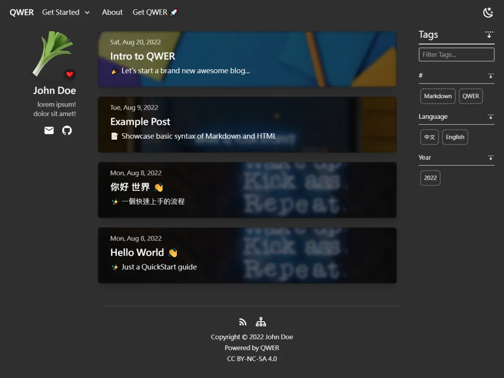
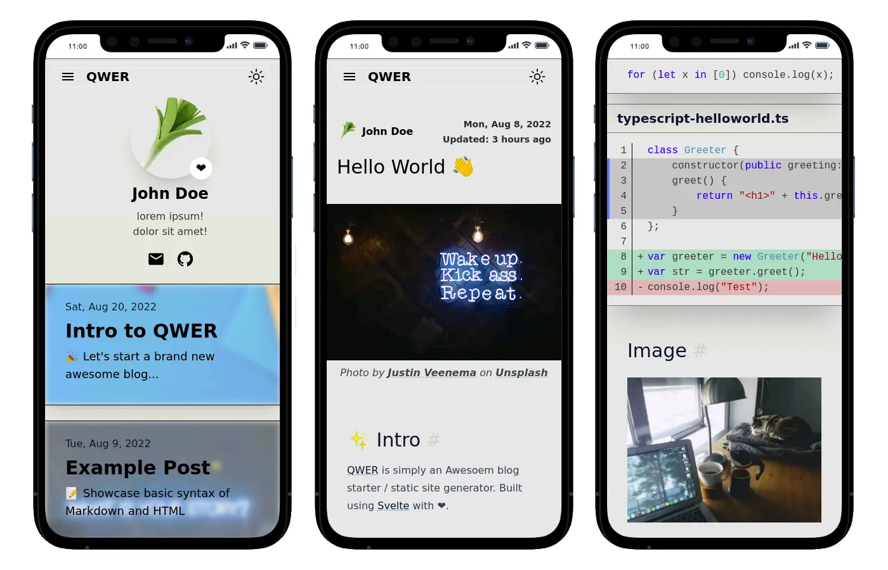

## 開頭

距今幾個月前，我無意間在 [SvelteThemes](https://sveltethemes.dev/) 找到了一個使用 [SvelteKit](https://kit.svelte.dev/) 寫的部落格生成器: [Urara](https://github.com/importantimport/urara)。換掉了我原來用 [Tailwind Nextjs Starter Blog](https://github.com/timlrx/tailwind-nextjs-starter-blog) 所架設的[部落格](https://kwchang0831-blog.vercel.app)。

:::info 資訊
使用 Urara 架設的網站目前已從 [kwchang0831.dev](https://www.kwchang0831.dev) 轉移至 [urara.kwchang0831.dev](https://urara.kwchang0831.dev)。
:::

當時我蠻喜歡 Urara 呈現的設計，挺簡潔有力的，而且網路跑起來的速度也是挺快的。

以下是 [urara.kwchang0831.dev](https://urara.kwchang0831.dev) 在 [PageSpeed](https://pagespeed.web.dev/) 上的評分：

## 遇到了問題

但，使用了約兩個月後，期間我遇到了些問題。

1. 我之前並沒有摸過 [Svelte](https://svelte.dev/)。剛開始進行客製化修改的時候，碰到了不少問題，有些邏輯也不是特別明白。不是很確定如何修正問題，也擔心改出問題，所以一直有種綁手綁腳的感覺。
1. 必須添加使用 `--max_old_space_size=7680` 的參數來進行 build。

    我並不是很確定這確切的原因，但有時 build 會因為這參數的記憶體數量太少而出錯，必須手動拉高記憶體設置才能避免報錯。
    後續甚至導致我進行 remote build 至 vercel 時都無法成功。

    不久前寫過一篇網誌: [從 Vercel 改成 Netlify 來架設 Urara](/blog/20220512)，正是為了處理這個問題。
    當時的解決方案就是，在本地端進行 local build，完成之後再上傳 prebuilt 來進行 deploy。

為了能夠更進一步地解決問題，我決定先把 [Svelte](https://svelte.dev/) 學好後再來慢慢研究。 而學習的方式，我決定採用 Project-Based Learning。

## QWER 的誕生

本來是想要重新寫一遍，好了解概念。但寫一寫，目標就不知不覺地變成了重新打造一個我心中的簡單好用的部落格網站。

因此我的新 Project 在兩個月前誕生了。而這個 Project 我取名為 **QWER**，象徵著簡單好用與快速。

QWER 的架構主要分成了兩部分

1. 專門處理使用者文章文檔與圖片等相關檔案的工具。

      使用者提供使用 Markdown 撰寫的文檔與照片等等檔案。這工具會轉換 Markdown 變成 HTML，並用已經設計好的模板來生成前端可以直接用的 Svelte 檔。

      從一開始，我就決定不使用 [MDsveX](https://github.com/pngwn/MDsveX) - 一個針對 [Svelte](https://svelte.dev/) 的 [Markdown](https://en.wikipedia.org/wiki/Markdown) 前處理器。我使用的是 [marked](https://github.com/markedjs/marked) 來幫我處理。理由就是簡單。我希望能夠維持一個相對 loosely coupled 的結構。我只需要一個能幫我處理從 Markdown Text → HTML 的處理工具，而我不要一個針對 [Svelte](https://svelte.dev/) 而且得要綁在一起的處理器。

      處理圖片時會按造設定來生成不同尺寸與格式的指令，以便後續生成響應式的圖片。其他檔案則會被移至正確的資料夾內。

      最後在完成所有檔案的處理之後會生成 metadata 詮釋資料，以便後續讓前端開發互動性的元件時可以更好地利用。

      這工具也需要能夠用即時偵測的方式來處理，讓使用者可以邊寫文章邊跑測試伺服器，可以即時看到頁面的更新。

1. Svelte 與 SvelteKit 打造的前端。

      這是頁面的設計與互動邏輯。包含了首頁設計，文章列表，標籤列表，文章頁面的設計，文章目錄，等等功能。

按造這架構模式來看，理想狀態下我應該可以把前端換成其他的框架，稍微修改一下就可以直接用了。

## 成果

廢話不多說，趕緊來看成果。

以下是 [kwchang0831.dev](https://www.kwchang0831.dev) 在 [PageSpeed](https://pagespeed.web.dev/) 上的評分：

### QWER 實際演示

### 目前狀態

雖然目前屬於 Pre-Alpha 的階段。但，我已經把 [QWER](https://github.com/kwchang0831/svelte-QWER) 用在 [kwchang0831.dev](https://www.kwchang0831.dev) 上了。

我還有一些功能還沒完工，而且很多功能還得再調整調整。

再來就是，因為開發的時間，相對來說比較趕也短，所以很多 code 寫得有點不大理想，醜陋又可怕。好在目前運行上沒有甚麼大問題，以後有時間再慢慢來優化或是重整。

## 當初的問題有解決嗎?

之前提出的問題，我都有達標解決。甚至我重新設計了我想要的標籤過濾功能與文章目錄，還有修正了很多細節小惡魔。

現在 build 的時候，不再需要 hard-coded 參數，也可以正常在 Vercel 與 Netlify 上 remote build 了。 這是對我來最重要的。而且現在都是自己寫出來的，哪裏有問題要修正，還不是立即的事。

我很開心，也很滿意當初的決定，在這不到兩個月裡的我真的學到了不少。

## 完結

最後，還望諸位先進大德，不忘吝嗇來幫我的 Github Repo 點個 Star ⭐ 鼓勵鼓勵一下。感謝再感謝🙏。

[kwchang0831/svelte-QWER](https://github.com/kwchang0831/svelte-QWER)
